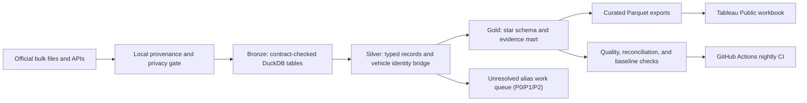

# Auto Evidence 360

## Project status

| Layer | Status |
|---|---|
| Local lakehouse pipeline (Bronze/Silver/Gold) | Complete, CI-run nightly on the real data, reconciled to the independent baseline |
| Curated Tableau exports | Complete (`data/tableau_public/`) |
| Tableau Public workbook | Staged (blueprint + calculated fields in `docs/TABLEAU_BLUEPRINT.md`), publish with owner approval |
| Cloud-ready Fabric notebooks | Reference code in `src/fabric/notebooks/` (runs unchanged in a Fabric Lakehouse) |
| Public GitHub release | This repository |
| LinkedIn series | Staged drafts in `docs/LINKEDIN_SERIES.md`, published only with owner approval |

## TL;DR

Auto Evidence 360 is a portfolio project built from **1,411,783 real public records**, not invented marketplace transactions. A local lakehouse pipeline (Python, DuckDB, Parquet) combines federal complaints, recalls, investigations, manufacturer communications, crash-test ratings, fuel-economy data, and state registrations to identify make/model/year combinations that deserve deeper human review, then publishes curated exports to a Tableau Public workbook.

By source family, the snapshot is:

- **581,642** complaint, recall, and investigation rows (the core safety-signal evidence).
- **731,898** manufacturer communication rows (service documents; volume can reflect documentation practice, not just signal).
- **98,243** NCAP, EPA, and registration context rows.
- **1,411,783** total source rows.

The result is intentionally called a **review-priority system**, not a safety or reliability score.

## The simple explanation

> I combined seven government datasets that describe different parts of a vehicle's history. A local lakehouse pipeline stores and cleans the data, a transparent identity bridge connects records that refer to the same make/model/year, and Tableau explains why a vehicle enters a review queue. The difficult part is making different sources comparable without overstating what the data proves.

That is the 30-second version. The technical implementation underneath it includes medallion architecture, source checksums, privacy minimization, entity resolution, text-topic classification, dimensional modeling, an unresolved-identity work queue, reconciliation tests, and nightly CI.

## Verified local snapshot

| Dataset | Publisher | Rows | Role in the analysis |
|---|---:|---|
| Consumer complaints, 2025-2026 | NHTSA | 182,995 | Self-reported problem and severe-outcome signals |
| Recalls, post-2010 | NHTSA | 244,398 | Campaign, consequence, remedy, and urgency evidence |
| Investigations | NHTSA | 154,249 | Formal investigation lifecycle evidence |
| Manufacturer communications, 2025-2026 | NHTSA | 731,898 | Service-document and emerging-topic signals |
| NCAP ratings | NHTSA | 17,313 | Tested crash-rating and feature context |
| Fuel economy vehicles | DOE/EPA | 50,242 | Efficiency, fuel-cost, emissions, and configuration context |
| State registrations | FHWA | 30,688 | State-level vehicle-population context only |
| **Total** |  | **1,411,783** |  |

Silver conforms vehicle records only. Equipment, tire, and child-seat records are excluded: **180,526 vehicle complaint rows** and **217,702 vehicle recall rows** enter the conformed layer. State registrations currently end in calendar year **2024**.

The authoritative landing pages are the [NHTSA Datasets and APIs catalog](https://www.nhtsa.gov/nhtsa-datasets-and-apis), [FuelEconomy.gov data services](https://www.fueleconomy.gov/feg/ws/index.shtml), and [FHWA motor-vehicle registrations catalog entry](https://catalog.data.gov/dataset/motor-vehicle-registrations-2000-2023-mv-1). Exact download URLs, grains, refresh notes, and limitations are in `config/sources.json` and `docs/SOURCE_REGISTER.md`.

## What makes the project hiring-grade

- **Traceable data:** every extract retains publisher, URL, retrieval time, source checksum, extract checksum, row count, and schema contract in `data/fabric_upload/manifest.json`; committed extracts are hash-verified by tests and CI.
- **Privacy by design:** complaint narratives, VIN fragments, city, contact, and operator fields are removed before anything is published.
- **Measured entity resolution:** two coverage measures are published - all valid keys (model years 1900 through current year plus one) and EPA/NCAP-era-eligible keys (model year 1984 or later). Exact-reference match rates vary widely by source; the current values are in `analysis/output/source_profile.md` and `docs/METRIC_CATALOG.md`. Unresolved names enter a prioritized alias work queue (P0, P1, or P2) rather than a hidden fuzzy join, and the operational evidence queue never depends on EPA/NCAP enrichment status.
- **Correct grains:** complaint reports, recall campaigns, investigations, service documents, tested NCAP variants, and EPA configurations are counted differently.
- **Responsible metrics:** the model never labels complaint volume as a defect rate because no make/model/year exposure denominator exists.
- **Explicit rule governance:** all review thresholds carry `rule_version = portfolio_v1` and `threshold_validation_status = unvalidated`; they are operating rules pending stakeholder validation, not federal standards.
- **Actionable BI:** every review-priority rule has a plain-language reason and drill-through evidence in the Tableau workbook.
- **Automated evidence:** GitHub Actions runs the full pipeline nightly, verifies every Gold number against the independent local baseline, and uploads fresh curated exports.

## Architecture



The same Bronze/Silver/Gold logic ships as PySpark notebooks in `src/fabric/notebooks/` and runs unchanged in a Microsoft Fabric Lakehouse (Delta tables, Direct Lake), so the pipeline is portable to the cloud stack.

## Repository map

| Path | Purpose |
|---|---|
| `config/sources.json` | Publisher URLs, grains, refresh cadence, and limitations |
| `scripts/download_source_data.py` | Safe downloader with ZIP path checks and SHA-256 metadata |
| `scripts/prepare_fabric_upload.py` | Privacy-minimized, compressed extract builder |
| `data/fabric_upload/manifest.json` | Row, schema, lineage, and checksum contract for the committed extracts |
| `src/local/01_ingest_bronze.py` | Bronze ingestion with manifest contract validation |
| `src/local/02_conform_silver.py` | Silver conformance and vehicle identity bridge |
| `src/local/03_build_gold.py` | Gold star schema, evidence mart, and rule queue |
| `src/local/04_export_curated.py` | Curated Parquet exports for Tableau |
| `src/local/run_pipeline.py` | Orchestrator with baseline reconciliation |
| `data/tableau_public/` | Committed curated exports (evidence summary, alias queue, data trust) |
| `src/fabric/notebooks/` | Cloud-ready PySpark variants of the same pipeline |
| `analysis/profile_real_sources.py` | Streaming profiler that emits aggregates without complaint narratives |
| `notebooks/01_real_source_quality.ipynb` | Executed, reader-facing source quality evidence |
| `docs/TABLEAU_BLUEPRINT.md` | Workbook design, calculated fields, interactions, and QA |
| `docs/INTERVIEW_GUIDE.md` | 30-second, 90-second, and technical explanations |
| `docs/LINKEDIN_SERIES.md` | Five posts with different evidence and employable skills |
| `archive/synthetic-prototype/` | Retired prototype, excluded from this project's claims and pipeline |

## Reproduce the evidence

Requires Python 3.10+.

```bash
python3 -m venv .venv && source .venv/bin/activate
pip install -r requirements.txt
python src/local/run_pipeline.py          # Bronze -> Silver -> Gold -> curated exports
python -m unittest discover -s tests -v   # repo, data, and pipeline contracts
```

The full pipeline takes about 25 seconds locally and re-runs idempotently: Bronze re-validates every extract against the manifest (schema, row count, committed hashes), Silver rebuilds identities, Gold rebuilds the star schema, and the orchestrator reconciles every Gold number against the independent baseline in `analysis/output/decision_baseline.json`. A failed contract stops the run.

To rebuild the extracts from fresh upstream downloads instead:

```bash
python3 scripts/download_source_data.py --list
python3 scripts/download_source_data.py     # downloads the source families
python3 scripts/prepare_fabric_upload.py    # rebuilds the csv.gz extracts + manifest
```

## Publish the Tableau Public workbook

1. Install Tableau Public Desktop (free, Mac and Windows) and sign in.
2. Connect to the three Parquet files in `data/tableau_public/` (or a fresh set from the pipeline run).
3. Build the workbook per `docs/TABLEAU_BLUEPRINT.md` (three dashboards, two calculated fields, one parameter).
4. Publish with "Show sheets as tabs" enabled, then update `README.md` status and the LinkedIn series with the live link.

## Interpretation boundary

Complaint records are self-reported. Recall rows can repeat one campaign across vehicles and components. Manufacturer-document volume can reflect documentation practice. NCAP tests cover selected variants and NHTSA labels the downloadable dataset as not quality-certified. State registrations do not provide make/model/year exposure.

The defensible conclusion is: **the public evidence justifies more or less review, and the dashboard shows exactly why.**