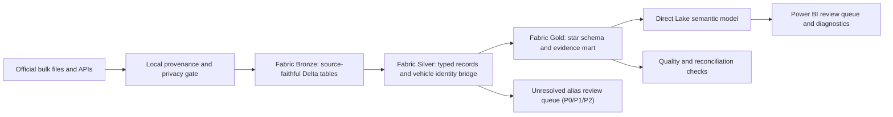

# Auto Evidence 360

## Project status

| Layer | Status |
|---|---|
| Local evidence foundation | Complete and verified (checksums, profiles, baseline, tests) |
| Microsoft Fabric build (Bronze/Silver/Gold) | Pending real execution in a Fabric workspace |
| Direct Lake semantic model | Pending |
| Power BI report (seven pages) | Pending |
| Public GitHub release | This repository |
| LinkedIn series | Staged drafts in `docs/LINKEDIN_SERIES.md`, published only with owner approval |

## TL;DR

Auto Evidence 360 is a Microsoft Fabric and Power BI portfolio project built from **1,411,783 real public records**, not invented marketplace transactions. It combines federal complaints, recalls, investigations, manufacturer communications, crash-test ratings, fuel-economy data, and state registrations to identify make/model/year combinations that deserve deeper human review.

By source family, the snapshot is:

- **581,642** complaint, recall, and investigation rows (the core safety-signal evidence).
- **731,898** manufacturer communication rows (service documents; volume can reflect documentation practice, not just signal).
- **98,243** NCAP, EPA, and registration context rows.
- **1,411,783** total source rows.

The result is intentionally called a **review-priority system**, not a safety or reliability score.

## The simple explanation

> I combined seven government datasets that describe different parts of a vehicle's history. Fabric stores and cleans the data, a transparent identity bridge connects records that refer to the same make/model/year, and Power BI explains why a vehicle enters a review queue. The difficult part is making different sources comparable without overstating what the data proves.

That is the 30-second version. The technical implementation underneath it includes medallion architecture, source checksums, privacy minimization, entity resolution, text-topic classification, dimensional modeling, DAX, reconciliation tests, and a governed action queue.

## Verified local snapshot

| Dataset | Publisher | Rows | Role in the analysis |
|---|---:|---|
| Consumer complaints, 2025-2026 | NHTSA | 182,995 | Self-reported problem and severe-outcome signals |
| Recalls, post-2010 | NHTSA | 244,398 | Campaign, consequence, remedy, and urgency evidence |
| Investigations | NHTSA | 154,249 | Formal investigation lifecycle evidence |
| Manufacturer communications, 2025-2026 | NHTSA | 731,898 | Service-document and emerging-topic signals |
| NCAP ratings | NHTSA | 17,313 | Tested crash-rating and feature context |
| Fuel economy vehicles | DOE/EPA | 50,242 | Efficiency, fuel-cost, emissions, and configuration context |
| State registrations | FHWA | 30,688 | State-level vehicle-population context only |
| **Total** |  | **1,411,783** |  |

Silver conforms vehicle records only. Equipment, tire, and child-seat records are excluded: **180,526 vehicle complaint rows** and **217,702 vehicle recall rows** enter the conformed layer. State registrations currently end in calendar year **2024**.

The authoritative landing pages are the [NHTSA Datasets and APIs catalog](https://www.nhtsa.gov/nhtsa-datasets-and-apis), [FuelEconomy.gov data services](https://www.fueleconomy.gov/feg/ws/index.shtml), and [FHWA motor-vehicle registrations catalog entry](https://catalog.data.gov/dataset/motor-vehicle-registrations-2000-2023-mv-1). Exact download URLs, grains, refresh notes, and limitations are in `config/sources.json` and `docs/SOURCE_REGISTER.md`.

## What makes the project hiring-grade

- **Traceable data:** every extract retains publisher, URL, retrieval time, source checksum, extract checksum, row count, and schema contract.
- **Privacy by design:** complaint narratives, VIN fragments, city, contact, and operator fields are removed before cloud upload.
- **Measured entity resolution:** two coverage measures are published - all valid keys (model years 1900 through current year plus one) and EPA/NCAP-era-eligible keys (model year 1984 or later). Exact-reference match rates vary widely by source; the current regenerated values are in `analysis/output/source_profile.md`. Unresolved names enter a prioritized alias work queue (P0, P1, or P2) rather than a hidden fuzzy join, and the operational evidence queue never depends on EPA/NCAP enrichment status.
- **Correct grains:** complaint reports, recall campaigns, investigations, service documents, tested NCAP variants, and EPA configurations are counted differently.
- **Responsible metrics:** the model never labels complaint volume as a defect rate because no make/model/year exposure denominator exists.
- **Explicit rule governance:** all review thresholds carry `rule_version = portfolio_v1` and `threshold_validation_status = unvalidated`; they are operating rules pending stakeholder validation, not federal standards.
- **Actionable BI:** every review-priority rule has a plain-language reason and drill-through evidence.

## Architecture



## Repository map

| Path | Purpose |
|---|---|
| `config/sources.json` | Publisher URLs, grains, refresh cadence, and limitations |
| `scripts/download_source_data.py` | Safe downloader with ZIP path checks and SHA-256 metadata |
| `analysis/profile_real_sources.py` | Streaming profiler that emits aggregates without complaint narratives |
| `notebooks/01_real_source_quality.ipynb` | Executed, reader-facing source quality evidence |
| `scripts/prepare_fabric_upload.py` | Privacy-minimized, compressed Fabric extract builder |
| `data/fabric_upload/manifest.json` | Row, schema, lineage, and checksum contract for cloud upload |
| `src/fabric/notebooks/01_ingest_bronze.py` | Bronze ingestion and manifest validation |
| `src/fabric/notebooks/02_conform_vehicle_entities.py` | Silver conformance and vehicle identity bridge |
| `src/fabric/notebooks/03_build_gold.py` | Gold star schema, evidence mart, and rule queue |
| `powerbi/measures.dax` | Explicit measures that respect each table's business grain |
| `docs/POWER_BI_BLUEPRINT.md` | Semantic relationships, report pages, interactions, and QA |
| `docs/INTERVIEW_GUIDE.md` | 30-second, 90-second, and technical explanations |
| `docs/LINKEDIN_SERIES.md` | Five posts with different evidence and employable skills |
| `archive/synthetic-prototype/` | Retired prototype, excluded from this project's claims and pipeline |

## Reproduce the evidence

Requires Python 3.10+ for the standard-library pipeline. The optional notebook uses pandas and nbformat.

```bash
python3 scripts/download_source_data.py --list
python3 analysis/profile_real_sources.py
python3 analysis/build_validation_baseline.py
python3 scripts/prepare_fabric_upload.py
python3 -m unittest discover -s tests -v
```

To replace a specific public snapshot, use an explicit source ID instead of downloading everything blindly:

```bash
python3 scripts/download_source_data.py --only nhtsa_recalls_post_2010 --force
```

The repository contract tests (`tests/test_repo_contract.py`) run from a clean clone without bulk data. The full hash and extract tests (`tests/test_real_data_contract.py`) run only when the ignored data package exists locally and skip automatically otherwise.

## Fabric build order

1. Create a Fabric workspace and Lakehouse named `lh_auto_evidence_360`.
2. Upload the seven compressed extracts plus manifest in `data/fabric_upload/` to `Files/landing/auto_evidence_360/`.
3. Create Fabric notebooks from `src/fabric/notebooks/01_ingest_bronze.py`, `src/fabric/notebooks/02_conform_vehicle_entities.py`, and `src/fabric/notebooks/03_build_gold.py`.
4. Run them in numerical order. A row-count, schema, referential-integrity, or alias-queue failure stops publication.
5. Create a Direct Lake semantic model from the Gold tables.
6. Add the relationships in `docs/POWER_BI_BLUEPRINT.md` and measures in `powerbi/measures.dax`.
7. Build the seven report pages, then capture lineage, refresh, model, and reconciliation evidence.

## Interpretation boundary

Complaint records are self-reported. Recall rows can repeat one campaign across vehicles and components. Manufacturer-document volume can reflect documentation practice. NCAP tests cover selected variants and NHTSA labels the downloadable dataset as not quality-certified. State registrations do not provide make/model/year exposure.

The defensible conclusion is: **the public evidence justifies more or less review, and the dashboard shows exactly why.**