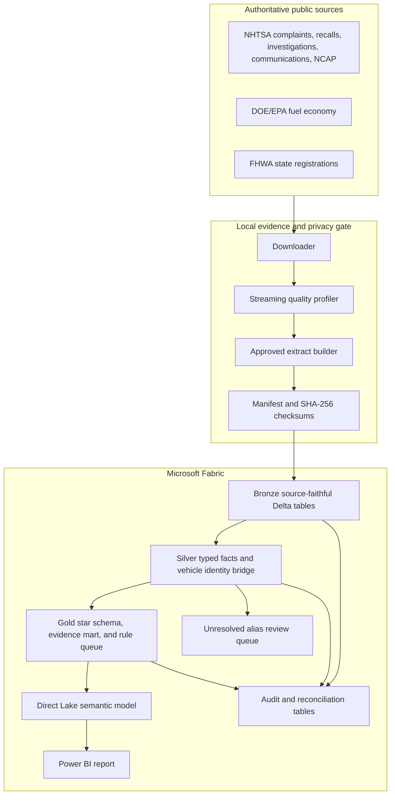

# Architecture

## System design



## Fabric item map

| Layer | Fabric item | Responsibility | Failure behavior |
|---|---|---|---|
| Orchestration | Data Factory pipeline | Parameterize landing path, run notebooks, record duration/status | Stop downstream activity on a failed gate |
| Storage | OneLake Lakehouse | Store approved extracts and managed Delta tables | Preserve prior successful tables until replacement succeeds |
| Bronze | Notebook 01 | Validate manifest, schema, row count, and attach provenance | Fail on missing, changed, or incomplete input |
| Silver | Notebook 02 | Type, deduplicate, normalize, classify topics, build vehicle bridge | Keep unresolved identities in a visible queue |
| Gold | Notebook 03 | Publish dimensions, facts, evidence mart, review queue, reconciliation | Fail on duplicate dimensions or orphan fact keys |
| Semantic | Direct Lake model | Relationships, explicit DAX, descriptions, formatting | Do not publish ambiguous implicit measures |
| Report | Power BI | Executive queue, diagnostics, evidence, coverage, trust | Show caveat and latest-source context on every page |

## Medallion contracts

### Bronze

- One Delta table per approved extract.
- All source values remain strings.
- `_source_id`, `_source_file`, source/extract SHA-256, `_batch_id`, and `_ingested_at` are mandatory.
- The uploaded manifest is the contract for file name, ordered columns, and expected row count.
- A contract failure writes audit evidence and stops the run.

### Silver

- Dates, numeric counts, ratings, flags, and model years are typed explicitly.
- Exact duplicate manufacturer communication and NCAP rows are removed deterministically.
- Complaint severity is calculated at report level from source flags and counts.
- Official/manufacturer descriptions receive one transparent keyword topic. This is explainable classification, not a learned defect prediction.
- `vehicle_key = SHA256(normalized make || normalized model || model year)`.
- EPA and NCAP form the reference key set. Exact reference matches are high confidence; other source identities remain unresolved to the reference and enter `silver_vehicle_alias_review_queue`.
- Source make/model text is preserved for audit. No fuzzy result is silently accepted.

### Gold

Dimensions:

- `gold_dim_vehicle`: one normalized make/model/year key.
- `gold_dim_date`: one calendar date across the observed evidence window.
- `gold_dim_evidence_topic`: one explainable topic label.

Facts:

| Table | Grain |
|---|---|
| `gold_fact_complaint` | one NHTSA complaint component record |
| `gold_fact_recall` | one recall product/component record |
| `gold_fact_investigation` | one investigation, vehicle identity, and component |
| `gold_fact_manufacturer_communication` | one document, vehicle identity, and component |
| `gold_fact_ncap_variant` | one tested vehicle variant |
| `gold_fact_fuel_economy_variant` | one EPA vehicle configuration |
| `gold_fact_state_registration` | one year, state, category, and registration type |

Decision outputs:

- `gold_agg_vehicle_evidence`: one vehicle identity with counts, coverage, context, priority, and reason.
- `gold_vehicle_review_queue`: non-monitor vehicles for human review.
- `gold_data_quality_checks`: uniqueness and referential-integrity results.

## Entity-resolution design

The bridge separates three questions that are often incorrectly merged:

1. **Can the source row form a valid make/model/year identity?**
2. **Does that normalized identity exactly match an EPA or NCAP reference?**
3. **Should a reviewed alias map two different source strings to one canonical vehicle?**

Only question 2 is automated in release 1. Question 3 needs an approved mapping with reviewer, timestamp, rationale, before/after key, and match confidence. This creates measurable work instead of hiding uncertainty in a fuzzy-match threshold.

## Orchestration

```text
pl_auto_evidence_refresh
  1. copy_or_validate_approved_extracts
  2. nb_01_ingest_bronze
  3. nb_02_conform_vehicle_entities
  4. nb_03_build_gold
  5. assert_gold_data_quality_checks
  6. refresh_direct_lake_model
  7. record_source_and_semantic_freshness
```

Release 1 uses complete snapshot replacement because the public bulk files are snapshot-oriented. A later incremental design can MERGE on source business keys while retaining snapshot checksums and effective dates.

## Governance and security

- Raw public complaint narratives and quasi-identifying fields stay local and are excluded before upload.
- Only the 23 MB approved extract package is uploaded, not the 1+ GB raw folder.
- Workspace roles separate author, reviewer, and viewer access.
- Public data creates no current geography-based confidentiality requirement, so artificial RLS is intentionally omitted.
- Endorsement occurs only after source, schema, row-count, uniqueness, orphan, and semantic reconciliations pass.
- Dataset and measure descriptions repeat the “public evidence, not reliability rate” boundary.

## Portfolio evidence to capture

- Source register plus local manifest/checksum evidence.
- Executed data-quality notebook.
- Fabric workspace lineage.
- Controlled Bronze failure and successful run.
- Entity-match coverage and alias-review queue.
- Lakehouse Gold tables and relationship diagram.
- DAX campaign-deduplication example.
- Power BI drill-through from priority to source evidence.
- Limitations page and three validated findings.
