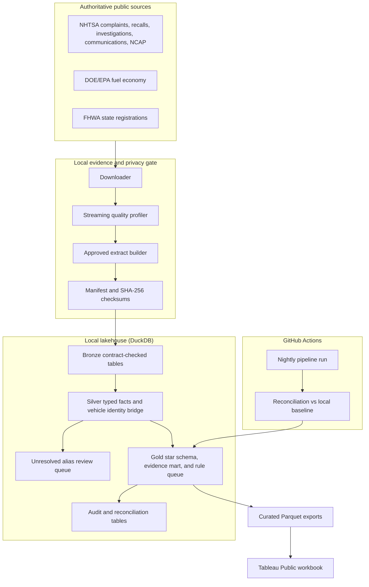

# Architecture

## System design



The same Bronze/Silver/Gold logic ships as PySpark notebooks in `src/fabric/notebooks/` and runs unchanged in a Microsoft Fabric Lakehouse (Delta tables, Direct Lake, Power BI), so the pipeline is portable to the cloud stack.

## Pipeline item map

| Layer | Item | Responsibility | Failure behavior |
|---|---|---|---|
| Orchestration | `src/local/run_pipeline.py` | Run Bronze, Silver, Gold, curated export, then reconcile every Gold number against the independent baseline | Exit non-zero on any failed gate |
| Storage | DuckDB file `data/lakehouse/auto_evidence_360.duckdb` | Store approved extracts as contract-checked tables | Preserve prior successful tables until replacement succeeds |
| Bronze | `src/local/01_ingest_bronze.py` | Validate manifest, schema, row count, and committed hashes; attach provenance | Fail on missing, changed, or incomplete input |
| Silver | `src/local/02_conform_silver.py` | Type, deduplicate, normalize, classify topics, build vehicle bridge | Keep unresolved identities in a visible queue |
| Gold | `src/local/03_build_gold.py` | Publish dimensions, facts, evidence mart, review queue, alias work queue, reconciliation | Fail on duplicate dimensions or orphan fact keys |
| Export | `src/local/04_export_curated.py` | Publish only small gold-level Parquet files for Tableau | Do not export raw records or P2 backlog rows |
| CI | `.github/workflows/ci.yml` | Nightly full pipeline on the committed extracts + contract tests | Scheduled run failure is visible on the repository page |
| Report | Tableau Public | Executive queue, diagnostics, evidence, coverage, trust | Show caveat and latest-source context on every dashboard |

## Medallion contracts

### Bronze

- One DuckDB table per approved extract; every value stays a string.
- `_source_id`, `_source_file`, source/extract SHA-256, `_batch_id`, and `_ingested_at` are mandatory.
- The committed manifest is the contract for file name, ordered columns, and expected row count; committed extract hashes are verified by tests.
- A contract failure writes audit evidence to `audit_bronze_ingestion` and stops the run.

### Silver

- Dates, numeric counts, ratings, flags, and model years are typed explicitly with `try_cast`.
- Exact duplicate manufacturer communication and NCAP rows are removed deterministically.
- Complaint severity is calculated at report level from source flags and counts.
- Official/manufacturer descriptions receive one transparent keyword topic. This is explainable classification, not a learned defect prediction.
- `vehicle_key = SHA256(normalized make || normalized model || model year)`.
- Valid model years span 1900 through current year plus one, consistently across local profiling, the local validation baseline, and the Fabric notebooks.
- Only vehicle product rows are conformed (product_type = V): 180,526 complaint rows and 217,702 recall rows.
- EPA and NCAP form the reference key set. Exact reference matches are high confidence; other source identities remain unresolved to the reference and enter `silver_vehicle_alias_review_queue`.
- Each bridge row carries `reference_year_eligible` (model year 1984 or later), `reference_match_status` (MATCHED/UNRESOLVED), `rule_version` (portfolio_v1), and `threshold_validation_status` (unvalidated).
- Source make/model text is preserved for audit. No fuzzy result is silently accepted.

### Gold

Dimensions:

- `gold_dim_vehicle`: one normalized make/model/year key.
- `gold_dim_date`: one calendar date across the observed evidence window.
- `gold_dim_evidence_topic`: one explainable topic label.

Facts:

| Table | Grain |
|---|---|
| `gold_fact_complaint` | one NHTSA complaint component record |
| `gold_fact_recall` | one recall product/component record |
| `gold_fact_investigation` | one investigation, vehicle identity, and component |
| `gold_fact_manufacturer_communication` | one document, vehicle identity, and component |
| `gold_fact_ncap_variant` | one tested vehicle variant |
| `gold_fact_fuel_economy_variant` | one EPA vehicle configuration |
| `gold_fact_state_registration` | one year, state, category, and registration type |

Decision outputs:

- `gold_agg_vehicle_evidence`: one vehicle identity with counts, coverage, context, priority, reason, and alias priority.
- `gold_vehicle_review_queue`: non-monitor vehicles for human review.
- `gold_alias_work_queue`: unresolved P0/P1 identities only; P2 stays as an aggregate count.
- `gold_data_quality_checks`: uniqueness, referential-integrity, and alias-queue results.

## Entity-resolution design

The bridge separates three questions that are often incorrectly merged:

1. **Can the source row form a valid make/model/year identity?**
2. **Does that normalized identity exactly match an EPA or NCAP reference?**
3. **Should a reviewed alias map two different source strings to one canonical vehicle?**

Only question 2 is automated in release 1, and it is published as two coverage measures: all valid keys, and EPA/NCAP-era-eligible keys (model year 1984 or later). Question 3 needs an approved mapping with reviewer, timestamp, rationale, before/after key, and match confidence. This creates measurable work instead of hiding uncertainty in a fuzzy-match threshold.

Gold publishes the unresolved backlog as a prioritized work queue:

- `P0`: unresolved identity with do-not-drive, park-outside, or open-investigation evidence.
- `P1`: unresolved identity with multi-source or high-signal evidence.
- `P2`: unresolved low-signal backlog, shown only as an aggregate count.

The operational review queue is independent of EPA/NCAP enrichment status: a vehicle can enter the review queue without ever matching a reference key.

## Orchestration

```text
python src/local/run_pipeline.py
  1. 01_ingest_bronze      manifest contract + provenance -> bronze_*
  2. 02_conform_silver     typing, identity bridge, alias queue
  3. 03_build_gold         star schema, evidence mart, review queue, quality checks
  4. 04_export_curated     evidence_summary / alias_work_queue / data_trust parquet
  5. reconcile             every Gold number vs analysis/output/decision_baseline.json
```

Release 1 uses complete snapshot replacement because the public bulk files are snapshot-oriented. `audit_bronze_ingestion` retains every batch, and a later incremental design can MERGE on source business keys while retaining snapshot checksums and effective dates. Nightly CI runs the pipeline on the committed extracts and uploads fresh curated exports as artifacts.

## Governance and security

- Raw public complaint narratives and quasi-identifying fields stay local and are excluded from the committed extracts.
- Only the approved 23 MB extract package is committed (hash-verified); the multi-GB raw folder is never stored in Git.
- Published Tableau data contains no PII: complaint narratives, VIN fragments, city, contact, and operator fields are absent by contract.
- Public data creates no current geography-based confidentiality requirement, so artificial RLS is intentionally omitted.
- Endorsement occurs only after source, schema, row-count, uniqueness, orphan, alias-queue, and baseline reconciliations pass.
- Dataset and measure descriptions repeat the "public evidence, not reliability rate" boundary.

## Portfolio evidence to capture

- Source register plus committed manifest/checksum evidence.
- Executed data-quality notebook and pipeline reconciliation output.
- Controlled Bronze failure and successful run.
- Entity-match coverage (all-valid and era-eligible) and the P0/P1/P2 alias work queue.
- `gold_data_quality_checks` and the nightly CI run history.
- Curated exports in `data/tableau_public/` and the live Tableau Public workbook.
- Three validated findings (do-not-drive, park-outside, open investigations) and the alias-review work queue as the human-in-the-loop story.